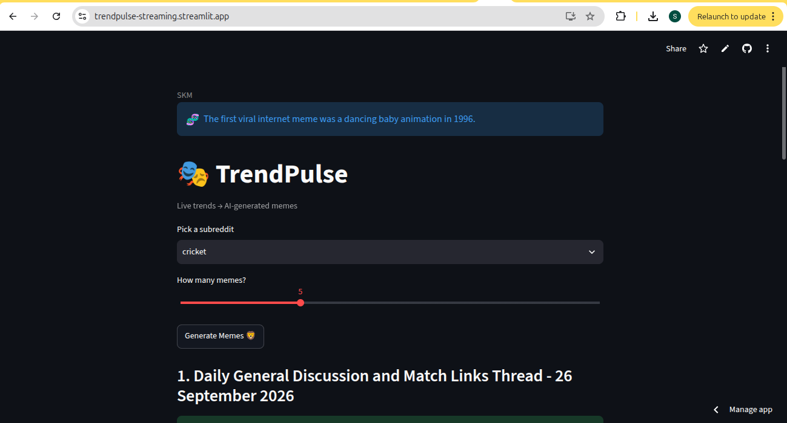

# TrendPulse 🎭

**Turning live trends into memes — a real-time data pipeline + LLM project.**
🔗 **Live demo:** https://trendpulse-streaming.streamlit.app

## What it does
1. Reads trending topics from Reddit / news RSS
2. Processes them with PySpark (sentiment + topic ranking)
3. Generates meme captions using an LLM
4. Shows the top memes in a public web app

## Status
🟡 Phase 1 in progress — text meme MVP

## Roadmap
- [ ] Reddit ingester
- [ ] LLM meme caption generator
- [ ] Streamlit app
- [ ] Deploy public URL
- [ ] Kafka + PySpark streaming
- [ ] Delta Lake medallion layers
- [ ] Airflow + monitoring

## Tech
Python · PySpark · Kafka · Delta Lake · LLM · Streamlit

## Why this project
Most portfolios have generic ETL pipelines. This one is a real data pipeline AND something people can actually play with.
